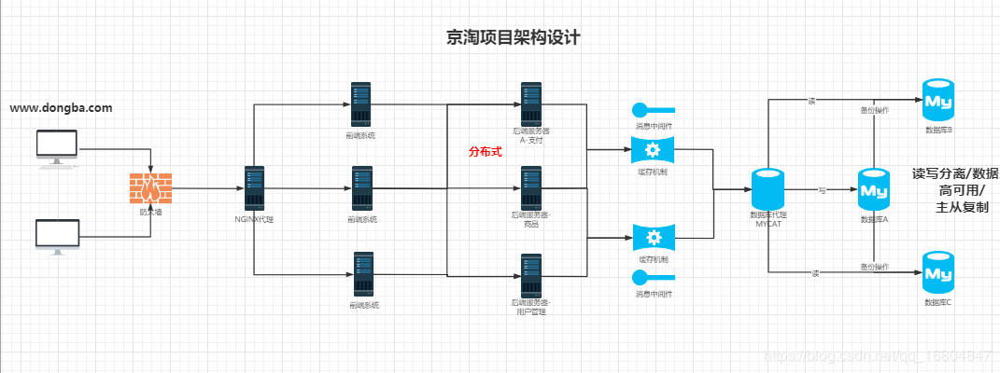

# JT-Yuanzhibx
> - About: [源志bx](http://blog.yanbingxu.com/)
> - `JT` 为分布式集群聚合项目
> - 该仓库为个人学习所用代码仓库, 如有错误欢迎指正
> - 文档在个人博客中编写, 欢迎访问 [blog.yanbingxu.com](http://blog.yanbingxu.com/)

---
## 项目结构
- [jt-common](./jt-common): 工具 API
- [jt-manage](./jt-manage): 后端业务系统 (提供者)
- [jt-web](./jt-web): 前端 Web (消费者)
- [jt-sso](./jt-sso): 单点登录 (提供者)
- [jt-cart](./jt-cart): 购物车 (提供者)
- [jt-order](./jt-order): 购物车 (提供者)

```
├─jt
│  ├─jt-common
│  ├─jt-manage
│  ├─jt-web
│  ├─jt-sso
│  ├─jt-cart
│  └─jt-order
```
> 

---
## 项目技术
<div style="text-align: center">


</div>

### 开发环境
> - OS: **macOS 10.15.3 / CentOS 7**
> - 语言: **JDK 1.8**
> - IDE: **IDEA 2020.1**
> - 依赖管理: **Maven 3.6.0**
> - 数据库: **MySQL 5.7.24**

---
## 文档
> - [JT_Yuanzhibx01 【Java】项目后台实现](http://blog.yanbingxu.com/2020/07/08/JT-Yuanzhibx01/)

> - [JT_Yuanzhibx02 【Nginx】Nginx 负载均衡](http://blog.yanbingxu.com/2020/07/15/JT-Yuanzhibx02/)

> - [JT_Yuanzhibx03 【Linux】项目部署到 Linux](http://blog.yanbingxu.com/2020/07/17/JT-Yuanzhibx03/)

> - [JT_Yuanzhibx04 【DATABASE】数据库高可用](http://blog.yanbingxu.com/2020/07/18/JT-Yuanzhibx04/)

> - [JT_Yuanzhibx05 【Redis 1】Redis 基本使用](http://blog.yanbingxu.com/2020/07/21/JT-Yuanzhibx05/)

> - [JT_Yuanzhibx06 【Redis 2】Redis 高级使用](http://blog.yanbingxu.com/2020/07/23/JT-Yuanzhibx06/)

> - 正在编写...

---
## 捐赠
| AliPay | WeChatPay |
| :----: | :----: |
|  |  |

---
## 联系
- `网站 1(博客)：` [blog.yanbingxu.com](https://blog.yanbingxu.com/)
- `网站 2(项目)：` [yanbingxu.com](http://yanbingxu.com/) (建设中)
- `CSDN：` [me.csdn.net/qq_44153697](https://me.csdn.net/qq_44153697)
- `Email：` <ybx0729@163.com>
